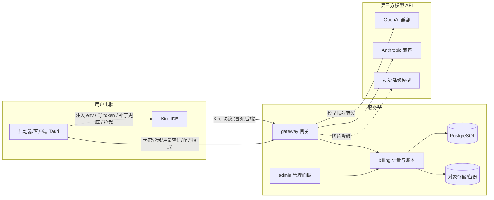
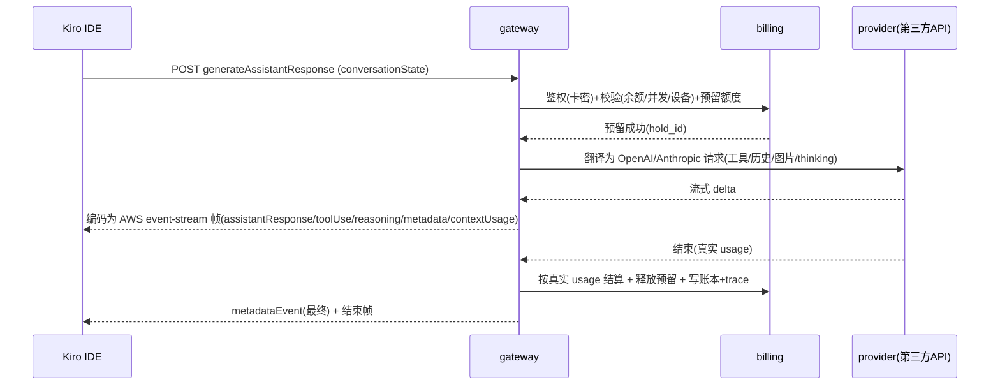

# Kiro BYOK 商业平台 — 设计文档 (Design Spec)

> 状态: 草稿 v0.4（第三轮查漏后，待用户复核定稿）· 日期: 2026-09-09 · 方法: Superpowers brainstorming (architectural path)
>
> 变更记录：v0.1 初稿 → v0.2 锁定范围决策 + 套餐虚拟化 + 可扩展性 → v0.3 第二轮双盲审计：修 6 处内部矛盾、补 2 个 bundle 实证协议缺口（保活、幂等）、补计费/安全/运维/客户端 19 项缺口 → v0.4 第三轮查漏：运营层（用户裁剪退款/客服/法务）+ **积分定价体系 §14.10**（用户明确要求）；审计边界声明 §17.7。
>
> 本文件是可实现的设计基线。所有关键假设都标注了**证据来源**（本机真实 Kiro bundle 核实 / 参考项目 / P0 验证结论）。P0 探针已全部锁定 Spec §16 的 11 条未知数（见 `docs/p0/DECISIONS.md`），所有原 `【待P0验证】` 项已全部由真实报文与逆向实证关闭。

---

## 1. 产品定义

一个面向终端用户按**卡密（激活码）**售卖的 Kiro IDE 接管平台。用户在桌面客户端用卡密登录，客户端把本机 Kiro IDE 的模型请求改道到我们的服务器；服务器完整扮演 Kiro 的云端后端，把模型请求映射到我们配置的**第三方 OpenAI / Anthropic 兼容 API**，并按卡密做用户隔离、积分计量与管控。

### 1.1 一句话目标

让付费用户在原生 Kiro IDE 界面里，用我们中转的第三方模型完成包含工具调用的完整 agent 工作流，同时我们能按卡密精确计量、隔离、管控和计费。

### 1.2 已确认的产品决策

| 决策项 | 选择 | 来源 |
|---|---|---|
| 模型来源 | 只映射第三方 OpenAI/Anthropic 兼容 API，不碰 Kiro 官方账号池 | 用户确认 |
| 客户端接管机制 | 混合：网络改道为主 + 补丁为辅 | 用户确认 |
| 规模目标 | 商业对外售卖，数百~数千并发，可水平扩展 | 推荐默认（用户未否决）|
| 服务端语言 | Rust (axum) | 推荐默认 |
| 桌面端 | Tauri v2 (Rust core + React/TS UI) | 推荐默认 |
| 管理面板 | React + TS + Vite + Tailwind | 推荐默认 |
| 分销层级 | **无**（两层租户：卡密/分组）| 用户确认 |
| 定制边界 | **有限钩子**：自定义模型列表 + 套餐/积分虚拟化（不改整个界面）| 用户确认 |
| CLI 支持 | **不做**，仅 IDE | 用户确认 |
| 卡密计时 | **从首次激活开始** | 用户确认 |
| 扩展性 | **一等设计目标**：后续加功能/加 provider/加前端钩子要低成本 | 用户确认 |

### 1.3 已锁定的范围（原待拍板项）

1. **无分销层级**：两层租户（卡密 → 分组）。数据模型不引入 distributor。
2. **定制边界 = 有限钩子**：MVP 只定制两类东西——(a) 模型列表（自定义增删改），(b) 套餐等级与积分显示（虚拟化，见 §1.4）。不追求"任意修改 Kiro 界面"。
3. **仅 IDE**：不冒充 `runtime.*.kiro.dev` 的 CLI 面。
4. **卡密从首次激活计时**：`valid_until` 在首次成功登录（激活）时才落定，而非生成时。

### 1.4 确认核心特性：套餐/模型虚拟化

因为登录、`ListAvailableModels`、`getUsageLimits`、`listAvailableSubscriptions` 全部由**我们的服务器应答**，用户在 Kiro 里看到的**套餐等级、模型列表、积分余额与真实 Kiro 订阅完全脱钩**，全部由卡密所属**分组**决定：

- 免费/任意等级的真实 Kiro 账号，登录后服务器可让它显示 **PRO/PRO+ 套餐名与对应模型列表**（`listAvailableSubscriptions` 返回我们设定的套餐，`getUsageLimits` 返回我们设定的额度）。
- 模型列表由分组的 `model_catalog` 定义，可任意增删改名，与用户真实订阅无关。
- 积分是我们自己的计量单位，显示值由分组/卡密决定。

这不绕过某个开关的"解锁"，而是**套餐虚拟化**——它同时是产品分级（不同分组=不同价位=不同模型集与积分）的核心杠杆。设计据此把"分组"作为一切能力的边界单元。

---

## 2. 关键技术发现（本机 Kiro 1.0.437 真实核实）

> 环境：Windows，`%LOCALAPPDATA%\Programs\Kiro`，`product.json` 报告 `version 1.0.437 / commit 5349479558... / quality stable`；agent 扩展 `kiro.kiro-agent` 报告 `kiroAgent 1.0.794`。

### 2.1 接管机制：env 改道优先，补丁兜底（对原方案的修正）

- extension.js 里 `q.us-east-1.amazonaws.com` **字面量只出现 1 次**（region→endpoint 覆盖表），真正的数据面走 AWS SDK 端点解析模板 `codewhispererstreamingservice.{Region}.amazonaws.com`（**出现 47 次**）。**结论：单纯 find/replace 字面量会漏掉 SDK 解析路径，不可靠。**
- bundle 内编译进标准 AWS SDK 的 `AWS_ENDPOINT_URL` / `endpoint_url` 解析器，且发现 `endpoint:t.endpoint||"https://runtime.us-east-1.kiro.dev"` 与 `KIRO_AUTH_PORTAL_URL`（`aId="https://app.kiro.dev",cId="KIRO_AUTH_PORTAL_URL"`）等**官方 endpoint 覆盖钩子**。
- **结论**：数据面改道**优先用启动时注入环境变量**（`AWS_ENDPOINT_URL` 系列 + `KIRO_AUTH_PORTAL_URL`），比改二进制抗升级得多。补丁仅作为 env 覆盖不到的场景的兜底。**（P0已验证：详见 `docs/p0/coverage.md` 与 `DECISIONS.md`，acp-q-client 固定端点需扩展补丁改道，无 checksums 风险）。**

### 2.2 持久性矛盾（原方案缺失，必须 P0 解决）

env 只在"经我们的启动器拉起 Kiro"时生效；用户双击原生桌面图标即绕过。候选方案：(a) 劫持/替换桌面快捷方式与开始菜单项使其指向我们的启动器；(b) 仍打补丁保证任意启动方式命中。**（P0已拍板：详见 `docs/p0/persistence.md`，选定 VSCode `settings.json` + `extension.js` 精准桩点打标方案，放弃脆弱的快捷方式劫持）。**

### 2.3 完整性校验边界（证实原判断正确）

`product.json` **确有 `checksums` 字段**，覆盖 `vs/workbench/workbench.desktop.main.js`、`vs/workbench/api/node/extensionHostProcess.js`、`vs/code/electron-browser/workbench/workbench.html` 等。改这些会触发完整性告警。**而 `extensions/kiro.kiro-agent/`（含 extension.js 与 webview）不在 checksums 内**，补丁打在扩展上是安全的。

### 2.4 需要冒充的接口面（比原方案更广）

| 接口面 | 证据 | MVP 处置 |
|---|---|---|
| 对话主面 `generateAssistantResponse` (streaming) | 参考项目 + bundle | **冒充（核心）** |
| Tab 自动补全 `GenerateCompletions` (独立 RPC，走 `CodeWhispererRuntimeClient`，报错含 "Autocomplete Failed: Maximum Kiro usage reached" → **吃额度**) | bundle 核实 | **MVP 关闭**（见 2.5），P4 再考虑冒充 |
| 会话标题生成 `SessionTitleGeneration` (LLM 调用) | bundle 核实 | **MVP 关闭** env `KIRO_DISABLE_SESSION_TITLE_LLM` |
| Session Recap `Recap` (LLM 调用) | bundle 核实 | **MVP 关闭** env `KIRO_DISABLE_RECAP` |
| 登录/刷新 `KIRO_AUTH_PORTAL_URL` + oauth/refresh | bundle 核实 | **冒充** |
| 模型列表 `ListAvailableModels` | 参考项目 + bundle | **冒充** |
| 额度 `getUsageLimits` / `listAvailableSubscriptions` | 参考项目 + bundle | **冒充** |
| Profile `ListAvailableProfiles` | 参考项目 | **冒充**（返回固定 profileArn）|
| 代码库索引 embeddings | bundle: `all-MiniLM-L6-v2` 本地模型打包在扩展内 | **不用冒充**（本地跑，不走云）|
| 遥测 telemetry | bundle: OpenTelemetry 语义 | 放行或静默丢弃 |
| `/mcp` 内置 web search | 参考项目 | P4 |

### 2.5 MVP 成本控制决策

autocomplete / session-title / recap 三个辅助面都会独立消耗第三方 API token，成倍放大成本。**MVP 关闭这三项**，只冒充对话主面。关闭方式不同：

- session-title 与 recap：环境变量 `KIRO_DISABLE_SESSION_TITLE_LLM=true`、`KIRO_DISABLE_RECAP=true`（bundle 核实存在），客户端启动 Kiro 时注入。
- Tab 自动补全：**是 VSCode 设置项** `kiroAgent.enableTabAutocomplete`（bundle 核实，非 env），客户端写入用户 `settings.json` 置为关闭。用户可能自行重新打开，因此**网关对未实现的 `GenerateCompletions` 必须返回结构良好的"额度已达上限"式错误**（Kiro 有对应 UI 文案 "Autocomplete Failed: Maximum Kiro usage reached"），而不是 404 或连接失败，保证优雅降级。

P4 视商业需要再决定是否把 autocomplete 也接上（高频面，接上意味着成本与计量都要重新评估）。

### 2.6 认证与 token 存储是大版本未知数

本机 `~/.aws/sso/cache` 为空（未登录），globalStorage 无 agent 数据。参考项目的 `~/.aws/sso/cache/kiro-auth-token.json` 来自 Kiro 0.x；本机是 1.0.437 / agent 1.0.794，跨大版本。bundle 里还出现 `KIRO_MACHINE_TOKEN` 等新变量。**（P0已锁定：详见 `docs/p0/auth.md`，1.0.x 仍然沿用 `~/.aws/sso/cache/kiro-auth-token.json`，TokenStorage 使用 fs.watchFile 热重载，外部写入即刻生效）。**

---

## 3. 系统架构



### 3.1 对话数据流（含计费点）



### 3.2 组件边界（每个单元一句话职责）

- `kiro-wire`：Kiro/AWS Q 协议类型 + event-stream 编解码。纯库，无 IO。
- `gateway`：冒充 Kiro 后端的 HTTP 门面 + 鉴权中间件 + 翻译器 + provider 适配器 + 计量钩子。
- `billing`：卡密/用户/分组/积分账本/配额/设备绑定/rate-card 的领域逻辑与持久化。
- `patch-engine`：Kiro 检测/版本识别/env 注入/补丁配方应用/备份还原。桌面端与 CLI 共用。
- `admin-ui`：管理面板（React）。
- `desktop`：Tauri 客户端（登录、接管、Doctor、用量）。

---

## 4. 网关接口契约（冒充 Kiro 后端）

> 所有响应 schema 必须匹配 **Kiro 1.0.x** 期望，字段以 P0 抓包为权威。以下为基于参考项目的**预期结构**，已由 P0 校准锁定（见 `docs/p0/mgmt-schema.md`）。

### 4.1 鉴权

- 客户端登录：卡密 → 换取短时 `access_token`(JWT, TTL 建议 1h) + `refresh_token`。**长效卡密永不落 Kiro token 文件**（见 §7）。
- 网关识别：Kiro 请求带 `Authorization: Bearer <access_token>`；网关校验签名 + 解析出 `card_id/group_id`（身份即卡密，无独立 user_id，见 §5）。JWT 内含 `token_version`，与 `card.token_version` 不符即失效（即时吊销，§7）。
- bundle 中未发现 JWT/jwks/issuer 客户端侧校验痕迹（搜索 `jwks|jwt.verify|issuer|verifySignature` 无命中），意味着 Kiro 大概率不校验我们签发的 token 的签发方 —— **（P0已证实：Kiro 无客户端验签逻辑，直接以 Bearer 传递，网关可完全自定义签名签发 JWT，见 `docs/p0/auth.md`）**。
- **即时吊销**：封号/冻结/换绑时 `card.token_version` 自增；网关每请求比对 JWT 内 `token_version` 与库中值（可走短 TTL 内存缓存），不等即拒。**不能只等 1h TTL**——封号后仍可用一小时不可接受。
- **完整登录态流程**（原 spec 只写到"换 token"）：Kiro 触发登录 → `KIRO_AUTH_PORTAL_URL` 指向我们的门户 → 门户要求卡密（或由桌面客户端自动完成握手）→ 回调 Kiro 本地回调端口（参考 `social.rs` 的 3128/4649/… 端口列表与 PKCE）→ 写入 1.0.x 登录态。**（P0已证实：亦可由桌面端/网关直接写入 `~/.aws/sso/cache/kiro-auth-token.json`，TokenStorage 使用 fs.watchFile 热重载即刻生效，见 `docs/p0/auth.md`）**。Kiro 内"登出"应清我们的 token；"切换账号"= 换卡密。
- **登录爆破防护**：卡密空间有限且可枚举，登录端点必须按 IP + 设备做限速与失败计数锁定；卡密本身用高熵格式（≥128 bit）并只存哈希。

### 4.2 端点清单

| 方法 | 路径 | 职责 | 计费 |
|---|---|---|---|
| POST | `/oauth/token`, `/refreshToken` | 卡密换 token / 刷新 | 否 |
| GET | `/ListAvailableModels` | 返回该分组自定义模型列表 | 否 |
| GET | `/getUsageLimits` | 返回卡密剩余积分/上限 | 否 |
| POST | `/listAvailableSubscriptions`, `/CreateSubscriptionToken` | 套餐信息 | 否 |
| POST | `/ListAvailableProfiles` | 固定 profileArn | 否 |
| POST | `/generateAssistantResponse` | 对话主面（流式）| **是** |
| POST | `/mcp` | web search (P4) | 视来源 |

### 4.3 对话翻译规则（工具调用完整性=硬指标）

Kiro `conversationState`（`currentMessage.userInputMessage` + `history` + `userInputMessageContext.tools/toolResults` + `images`）双向翻译为第三方格式。必须处理的坑（参考项目已踩过）：

- **工具名缩短与还原**（Kiro 工具名长；上游有长度限制）。
- **孤立 tool_use/tool_result 修复**（配对错误上游不可恢复）。
- **超长 tool description 挪进 system prompt**，原位置留引用（kiro-gateway 的 Tool Documentation Reference Pattern）。
- **图片 >400KB 压缩/重编码**（ZyphrZero `image_resize.rs`：长边 1568、JPEG 质量 85、GIF 保留）。
- **thinking/reasoning**：`reasoningContentEvent` ↔ Anthropic thinking / OpenAI reasoning。
- **stop_reason 映射**。

### 4.4 event-stream 编码（成败关键）

响应必须编码为 AWS 二进制 event-stream（**非 SSE**）：12B prelude（total_length/header_length/prelude_crc32）+ headers + JSON payload + message_crc32。事件类型：`assistantResponseEvent`/`toolUseEvent`/`reasoningContentEvent`/`metadataEvent`/`contextUsageEvent`/`meteringEvent`。移植 `kiro-wire` from `references/ZyphrZero-kiro.rs/src/kiro/parser/**` 与 `model/events/**`；编码器参考 `references/kiro-custom-model-hijacker/aws_event_stream.py`（但该编码器从未被 Kiro 严格解码器验证过工具事件的分片 JSON 与 CRC，P0 必须用真实帧做一致性测试）。

### 4.5 contextUsageEvent 的副作用（原方案低估）

上报的 context 使用率会驱动 Kiro 的**自动对话压缩**触发时机（算错会过早/过晚压缩，正是 antigravity-studio "放宽压缩阈值"要解决的痛点）。因此每个模型的 `model_map.context_window` 要真实，percentage = used_tokens / context_window 要算准。used_tokens 用 tiktoken 估算（Kiro 不给 token 数），窗口取自 `model_map`。

### 4.6 流保活与空闲看门狗（第二轮审计新增，bundle 实证）

bundle 核实 Kiro 有 `StreamIdleTimeoutError` / `sessionIdleTimeout` 与 gRPC keepalive ping/pong（对应 env `KIRO_FEATURE_STREAM_IDLE_WATCHDOG_ENABLED`）。**上游第三方 API 在首 token 前、工具循环间、web search 期间可能长时间无字节；网关必须周期性向 Kiro 发保活帧**（空 `assistantResponseEvent` 或与真实流兼容的 keepalive），否则 Kiro 判定空闲超时主动断流、会话失败。**（P0已证实：看门狗阈值为预警 60s、断流 300s，网关每 20~25s 发送一次空 `assistantResponseEvent`（`{"content": ""}`），UI 层静默忽略且能重置看门狗，见 `docs/p0/stream.md`）**。

### 4.7 请求幂等与重试去重（第二轮审计新增，bundle 实证）

bundle 核实 Kiro 用 AWS SDK 标准重试（`maxAttempts`、`amz-sdk-request: attempt=1; max=3`、adaptive retry）。**连接抖动/超时会让 Kiro 重发同一逻辑请求**，若网关不去重会**重复转发上游 + 重复计费**。

- 幂等键：每个逻辑请求带稳定的 `amz-sdk-invocation-id`（同一请求的多次 attempt 复用同一 id）。**（P0已证实：AWS SDK 在重试循环初始化时生成 UUIDv4，在所有 retry attempts 间 100% 稳定，可靠作为幂等键，见 `docs/p0/stream.md`）**。
- 网关按 `invocation_id` 去重：已在进行中→挂到同一响应或拒绝并发副本；已完成→返回缓存结果或幂等短路，不重复计费。
- `usage_ledger.invocation_id` 与 `credit_reservation.invocation_id` 加唯一约束兜底。

---

## 5. 数据模型（Postgres，多租户）

> 两层租户（卡密 → 分组），无分销层（用户确认）。**身份即卡密**：无独立 `user` 表，一张卡密 = 一个用户身份；token 里承载 `card_id` 与其 `group_id`，不再有独立 `user_id`（修正原 §4.1 的口径）。

- `card`：`id, code_hash, template_id, group_id, credit_total, credit_used, credit_reserved, status(unactivated/active/frozen/banned/expired), activated_at(NULL 直至首次登录), valid_until(激活时 = activated_at + template.duration，激活前为 NULL), max_devices, rebind_count, token_version(用于即时吊销，见 §7), note, created_at` —— **计时从首次激活开始**（用户确认）
- `card_template`：`id, name(日卡/周卡/月卡/按量卡…), duration, credit_total, max_devices, max_concurrency, group_id` —— 卡密类型模板
- `user_session`：`id, card_id, device_fingerprint, access_token_jti, refresh_token_hash, last_seen, kiro_version, patch_version, gw_protocol_version`
- `group`：`id, name, provider_binding_mode(shared/dedicated), rate_card_id, margin_multiplier(分组级倍率，§14.10), virtual_plan_name(显示给 Kiro 的套餐名，如 PRO/PRO+), virtual_usage_limit(显示给 Kiro 的额度口径，积分口径 §14.10.4), system_prompt_prefix(可空)` —— **套餐虚拟化的承载体**（§1.4）
- `settings`（全局单行）：`credit_face_value_cny(1 积分=多少元), usd_cny_rate, rate_updated_at` —— **积分与货币的锚点**（§14.10.1）
- `model_map`：`id, group_id, exposed_model_id, target_provider_id, target_model, context_window, max_output, supports_tools/vision/reasoning, credit_multiplier, visible(bool，驱动按分组可见性), sort_order` —— **模型目录即 `model_map` 按 `group_id` 的集合**（消除原 `group.model_catalog_ref` 与 `model_map` 双写的矛盾：只保留 `model_map`，`group` 不再持 catalog 引用）
- `provider`：`id, name, format(openai/anthropic), base_url, enabled, weight, health_state, cooldown_until, group_id(NULL=共享池；非 NULL=专属于某分组，配合 `group.provider_binding_mode=dedicated`)` —— **明确 dedicated 绑定靠 `provider.group_id`**
- `provider_key`：`id, provider_id, api_key_encrypted, enabled, weight, health_state, cooldown_until` —— provider 多 Key 拆出独立表（支持加权轮询/冷却，原 §14.3 需要）
- `rate_card` + `rate_card_version`：`model, currency(USD/CNY), input_price, output_price, cache_creation_price, cache_read_price(成本侧每 1M token 单价), pricing_mode(cost_plus/fixed/per_call), fixed_input_credit_per_m, fixed_output_credit_per_m, per_call_credit, margin_multiplier(全局毛利倍率), effective_from`（**版本化**，历史用量按当时版本计价；三种定价模式见 §14.10.2）
- `usage_ledger`：`id, card_id, ts, kind(usage/adjustment/topup), invocation_id(Kiro amz-sdk-invocation-id，幂等键，`kind=usage` 时唯一约束), exposed_model, provider_id, target_model, input_tokens, output_tokens, cache_creation_tokens, cache_read_tokens, credits_charged(整数微积分), provider_cost_micro_cny(成本侧，供毛利报表), rate_card_version, request_id, operator_id, reason(后两者仅 adjustment/topup 用)`（**追加式账本，扣费权威**；`invocation_id` 唯一约束防 SDK 重试双扣，见 §4.7/§6；**人工调账也以条目形式写入，不直接改余额**）
- `credit_reservation`：`id, card_id, invocation_id, reserved_credits, state(held/settled/released), created_at, expires_at(TTL，janitor 回收孤儿预留)`（并发预留）
- `request_trace`：`id, card_id, ts, invocation_id, exposed_model, status, ttft_ms, tok_per_s, error_class, provider_id, attempt_chain`（**不含对话正文**）
- `admin_user` / `audit_log`：管理员账号 + 操作审计。

> 积分单位：`credit` 全程用**整数微积分**（如 1 credit = 1_000_000 micro）存储与运算，避免浮点漂移（修正原 §6 未定义精度）。展示层再换算。

---

## 6. 计费与计量（钱袋子，原方案缺口最多）

1. **按 provider 真实 usage 计费，不用 tiktoken 计费**。真实 usage（第三方 API 返回）是扣费权威；tiktoken 只用于算 context 百分比。不返回 usage 的中转 API 才回退估算 + 安全余量。
2. **预留/结算模型解决并发击穿**：请求开始冻结预估上限（`credit_reservation`），结束按真实 usage 结算并释放差额。防止多并发 agent 循环刷穿到负。
   - **预留额估算策略**（原 spec 未定义）：`reserve = (tiktoken(输入) × input_price + max_output × output_price) × multipliers`，其中 `max_output` 取 `model_map.max_output`。余额不足以覆盖预留时**拒绝请求**（返回 Kiro 可识别的额度不足错误），而不是允许"最后一次可能超支"。
   - **孤儿预留回收**：网关崩溃/连接中断会留下 `held` 状态预留。`credit_reservation.expires_at` + 定时 janitor 释放过期预留；释放时若上游确实已产出则按 trace 中最后已知输出补记账本。
3. **失败与中断的退费语义**：
   - 流式中途 provider 失败 → 只结算已产出的输出 token，释放其余预留。
   - **用户主动中断**（Kiro 里点停止，连接被客户端关闭）→ 网关必须**向上游发起取消**并停止计量；已产出部分按实际结算。不取消上游 = 用户不付钱但我们付了。
4. **rate-card 版本化**：provider 涨价后历史用量按当时 `rate_card_version` 计价。
5. **缓存 token 分级计费**：Anthropic `cache_creation` vs `cache_read` 费率不同，分开计（参考 ZyphrZero cache metering）。
6. **积分模型**：`credit = Σ(token × 单价 × credit_multiplier × margin_multiplier)`，全程整数微积分（§5）；日/月上限、并发上限、设备数上限、卡密有效期均可配。
7. **幂等计费**（第二轮审计新增）：同一 `invocation_id` 只计费一次（§4.7）。SDK 重试、客户端重连不得产生第二条账本。
8. **成本侧账本**：`usage_ledger` 同时记录 provider 侧成本（按 rate-card 底价），毛利报表（§14.4）直接从账本聚合，不另建数据源。

---

## 7. 安全设计（多租户 + 收钱，标准更高）

| 领域 | 要求 |
|---|---|
| 卡密不落地 | 卡密只换短时 access+refresh；长效卡密永不写入 Kiro token 文件；TTL + 轮换；卡密 ≥128 bit 高熵、只存哈希 |
| 即时吊销 | `card.token_version` 比对（§4.1），封号/冻结/换绑立即生效，不等 TTL |
| 登录爆破防护 | 登录端点按 IP + 设备限速、失败计数锁定、可选验证码；卡密空间不可枚举 |
| provider key | libsodium/age 或 KMS 封装存储；永不返回客户端；永不入日志；admin UI 脱敏显示 |
| **主密钥引导** | 加密 provider key 的主密钥（KEK）从**环境变量/KMS/文件（0600）** 注入，**不入库、不入仓库、不入镜像**；轮换流程：新 KEK 重封装所有 `provider_key`，双写窄窗口。原 spec 只说"加密存储"没说钥匙放哪 |
| 多租户隔离 | Postgres RLS 或强制租户作用域的仓储层，不靠人肉 `WHERE`；跨租户访问在 DB 层被拒 |
| admin 鉴权 | 真实账号 + 2FA + 操作审计日志；admin 面板与 Kiro 门面**监听不同端口/域名**，admin 不暴露给公网或限 IP |
| 滥用防护 | 每卡密限流、请求体大小上限（含图片总量）、上游并发闸门、异常速率/多设备检测、prompt 长度上限 |
| 隐私 | 只记请求元数据（模型/tokens/状态/时延），**不记对话正文与 API key**；日志脱敏中间件统一处理 |
| TLS | 网关必须真实证书（Kiro 会正常校验 TLS）；Caddy 自动签发 |
| 供应链 | 依赖锁定（`Cargo.lock`/lockfile 提交）、`cargo audit`/`cargo deny` 进 CI、发布二进制签名 |

---

## 8. 运维与可靠性（部分从 P5 前移）

- **备份 + PITR**：Postgres 逻辑备份 + WAL 归档，**P2 就要有**（收钱产品丢数据=退款+砸招牌），不等 P5。
- **基础限流 P2**：单卡密限流 + 上游并发闸门（AnyBridge `BYOK_MAX_INFLIGHT` 思路）。**分布式**多实例限流才用 Redis，放 P5。
- **provider 故障优雅降级**：某模型所有 provider 中途全挂时，发 Kiro 能识别为"可重试错误"的事件帧，不让 agent 会话崩（接 Kiro-Go `stream_integrity.go` / truncation-recovery）。
- **协议破坏 kill-switch / 维护模式**：检测到冒充协议被 Kiro 新版打破时，服务端下发维护标志，客户端提示"暂停使用"而非狂刷错误。
- **健康信标**：客户端上报 Kiro 版本 + 补丁版本 + 网关协议版本，让运营在数分钟内发现某新版把数据面打挂。
- **禁用 Kiro 自动更新**：客户端接管时设 `update.mode: none` 并（视 P0 结果）拦截 updateUrl，避免静默升级使补丁/协议假设失效。
- **上游看门狗（三级超时）**（第二轮审计新增）：对第三方 API 用 TTFB / idle / hard 三级超时（参考 AnyBridge 上游看门狗），而非单一 timeout——长流式请求不被误杀，卡死的上游能被及时切走并触发故障转移。
- **优雅停机**（新增）：网关收到 SIGTERM 后停止接新请求、等待进行中的流式请求完成（有上限）或向 Kiro 发可重试错误帧、结算/释放所有预留，再退出。**滚动发布不得让用户会话半途崩且钱已扣**。
- **健康与指标端点**（新增）：`/healthz`（存活/就绪）、`/metrics`（Prometheus：QPS、TTFT、错误率、provider 冷却数、预留数、账本延迟），供编排与告警。
- **依赖故障隔离**：Postgres 短暂不可用时，鉴权走短 TTL 缓存、账本写入进本地队列重放（有上限，超限拒绝新请求），避免 DB 抖动直接全站 5xx。
- **迁移与回滚**：sqlx 迁移只追加、可回滚；发布前在快照上演练迁移。

---

## 9. 客户端设计（Tauri）

- 登录：卡密 + 设备指纹绑定；换短时 token。
- Kiro 检测：Win/mac/Linux 安装路径、版本识别（读 `product.json`）。
- 接管：**首选 env 注入启动**（`AWS_ENDPOINT_URL`*、`KIRO_AUTH_PORTAL_URL`、关闭 recap/title/autocomplete 的 env）+ 写登录态；**补丁兜底**（配方式：首行 MARKER + `.backup` + dry-run + restore + 升级后重打，参考 chaogei kpatch）。
- 持久性：解决双击原生图标绕过 env 的问题（快捷方式劫持 vs 补丁，P0 定）。
- macOS 签名：改签名过的 `.app` 会破坏签名触发 Gatekeeper —— **又一个 env 启动方案优于改文件的理由**；补丁在 macOS 上尽量只碰未签名的扩展目录。
- Doctor：连通性、补丁/接管完整性、token 文件、Kiro 版本、网关协议版本，一键修复。
- 用量与余额、模型偏好、服务端下发的 UI 覆盖配置、托盘、自动更新（客户端自身的）、版本协商握手。
- **Kiro 运行中的接管边界**（第二轮审计新增）：接管/恢复/写 token/打补丁前必须检测 Kiro 是否在运行；运行中禁止改文件（VSCode 会缓存并可能回写），给出"请先关闭 Kiro / 由我们重启"的明确交互，避免半状态。
- **单实例锁**：客户端自身单实例（防两份客户端争抢补丁/env）；对 Kiro 用其 `win32MutexName` / 进程探测判断运行态。
- **Windows 特有**：写 `%LOCALAPPDATA%\Programs\Kiro` 与快捷方式**不需管理员权限**（用户级安装），避免 UAC；若检测到系统级安装（`Program Files`）则提示。补丁/启动器可能被 AV 误报（改 IDE 文件 + 自签发布）——发布二进制**代码签名**列为 P3 必要项。
- **首次接管的可逆快照**：接管前对将改动的 env/快捷方式/settings 键/补丁文件做一次快照存本地，"恢复官方直连"精确回滚到快照（§14.5）。
- **崩溃与日志**：客户端本地日志滚动、脱敏；崩溃报告可选上报（不含代码/提示词）。

---

## 10. 版本兼容矩阵（原方案缺失）

{Kiro 版本 → 补丁配方 → 网关协议版本} 三者登录时协商。客户端上报 Kiro 版本，服务端返回对应配方与协议版本；不匹配的组合给出明确指引而非未定义行为。配方由服务端下发，Kiro 升级后无需发新客户端即可热修。

---

## 11. 技术选型评审结论

- **Rust 网关**：正确。协议代码可直接移植 kiro.rs（最难部分）。**风险：P2 计费/后台是大量 CRUD，Rust 比 Go/TS 慢**——保持 Rust 但工期预算留够，用 sqlx 编译期校验 + 严格迁移。
- **Tauri 客户端**：合理。真正风险在 patch-engine 的 macOS 签名（见 §9），env 方案规避之。
- **需在架构预留位**：密钥管理（KMS/age）、通知渠道（邮件/webhook：卡密发放、余额不足、provider 故障告警）、用量聚合异步 worker。MVP 可后置。

---

## 12. 风险矩阵

| 风险 | 影响 | 概率 | 对策 |
|---|---|---|---|
| Kiro 静默升级打破协议/覆盖补丁/换 token 存储 | 全体断服 | 高 | 禁用自动更新 + 配方热下发 + kill-switch + 健康信标 |
| event-stream 工具事件编码不被严格解码器接受 | agent 循环崩/卡死 | 中高 | P0 真实帧一致性测试语料；接 truncation-recovery |
| 1.0.x token 存储/schema 与假设不符 | 登录/UI 全崩 | 高 | P0 抓真实登录锁定，不带假设进 spec |
| 并发余额击穿 | 亏钱 | 中 | 预留/结算模型 |
| 计费口径错（估算 vs 真实） | 亏钱/纠纷 | 中 | 真实 usage 计费 + rate-card 版本化 |
| provider key 泄漏 | 命根子 | 低概率高危 | KMS/age + 脱敏 + 不入日志 |
| 单 Postgres 故障丢数据 | 退款/砸招牌 | 中 | P2 备份 + PITR |
| macOS 改签名 app 触发 Gatekeeper | mac 用户装不上 | 中 | env 启动方案；只碰未签名扩展 |
| **Kiro 空闲看门狗断流**（长等待无字节） | 工具循环/搜索中会话失败 | 高 | 网关周期保活帧（§4.6） |
| **SDK 自动重试导致双重转发/双扣** | 亏钱+纠纷 | 中高 | `invocation_id` 幂等去重 + 账本唯一约束（§4.7/§6.7） |
| **封号后 token 仍有效到 TTL** | 滥用窗口 | 中 | `token_version` 即时吊销（§4.1） |
| **用户中断但上游未取消** | 我们付钱用户不付 | 中 | 中断→取消上游+停止计量（§6.3） |
| **网关崩溃留下孤儿预留** | 用户余额被虚占 | 中 | 预留 TTL + janitor（§6.2） |
| **卡密被枚举/爆破** | 盗用 | 中 | 高熵+哈希+登录限速锁定（§4.1/§7） |
| **主密钥泄漏或丢失** | 全部 provider key 泄漏/不可解 | 低概率极高危 | KEK 外置注入 + 轮换流程 + 离线备份（§7） |
| **Kiro 运行中改文件致半状态** | 补丁/登录态损坏 | 中 | 运行态检测 + 禁止运行中改文件（§9） |
| **Windows AV 误报客户端** | 用户装不上/被删 | 中 | 代码签名 + 尽量 env 不改文件（§9） |
| 合规/条款（改本地文件+替换后端） | 法律/封号 | — | 产品决策层风险，需用户知悉 |

---

## 13. 分阶段交付（每阶段独立 spec → plan → 实现）

- **P0 探针（1–2 天，抛弃型）**：stub 服务器 + env 改道方案落地；抓 1.0.437 真实的登录/刷新/模型/额度/对话（含工具、图片）报文；确定：env 覆盖面、持久性方案、token 存储位置与 schema、event-stream 工具帧真实结构。**产出：真实报文样本 + 差异清单 + 决策记录，作为 kiro-wire 测试语料与后续 spec 依据。**
- **P1 网关核心**：`kiro-wire` 移植 + 冒充门面路由 + OpenAI/Anthropic 适配器 + 双向翻译（工具/历史/图片/thinking）+ event-stream 流式 + 单卡密硬编码鉴权 + Postgres 基础表 + 预留/结算账本雏形。**验收：本机 Kiro 经 DeepSeek/Claude 完成含文件读写工具的多轮对话；积分与模型列表在原生 UI 正确显示；用 P0 语料通过帧一致性测试。**
- **P2 计费与后台**：卡密/用户/分组/rate-card（版本化）/预留结算/配额并发/设备绑定/provider 治理与测试/模型映射/用量报表与请求日志/管理面板 + **备份PITR + 基础限流 + 密钥加密**。
- **P3 桌面客户端**：登录+设备绑定/Kiro 检测/env 接管+补丁兜底/持久性/token 写入/进程重启/Doctor/版本协商握手/健康信标/用量余额/UI 覆盖配置/自动更新。
- **P4 增强**：服务端下发配方与 UI 覆盖/视觉降级/`/mcp` 搜索/告警通知渠道/充值码/（评估 autocomplete 冒充）/Kiro CLI。
- **P5 规模化**：Redis 分布式限流/多实例/只读副本/备份恢复演练。

---

## 14. 查漏补缺：原规划未覆盖的功能

> 通过审计 + 对照参考项目的管理面（Kiro-Go `web/locales/zh.json`、ZyphrZero `admin-ui/`、chaogei 管理器、cursor-byok、AnyBridge、antigravity-studio）梳理出的补充项。按阶段归位；"必要"表示不做就影响商业可用性。

### 14.1 卡密生命周期与发卡运营（P2，必要）

| 功能 | 说明 | 原规划状态 |
|---|---|---|
| 卡密批量生成与导出 | 按类型/额度/有效期/分组批量生成，导出 CSV/JSON 供发卡平台或人工分发 | 有提"批量生成"，缺导出与格式 |
| **发卡平台对接** | Webhook/API 供第三方发卡平台（如常见的独立发卡系统）拉取库存、回调核销；否则运营只能手工 | **缺失** |
| 卡密类型模板 | 预设"日卡/周卡/月卡/次卡/按量卡"模板，含额度、有效期、并发、设备数、分组 | 部分 |
| **激活即计时 vs 生成即计时** | 有效期从**首次激活**开始还是从**生成**开始？两种都要支持（发卡平台常按激活计时） | **缺失（歧义）** |
| 充值/续费码 | 对已激活卡密追加积分或延长有效期，不换卡密 | 已提（P4）→ **建议前移 P2**（续费是复购主路径）|
| 卡密换绑/解绑设备 | 用户换电脑；限制换绑次数与冷却 | **缺失** |
| 冻结/解冻/封禁/备注 | 运营处置 + 内部备注/昵称 | 部分（有 status）|
| 批量操作 | 批量冻结/启用/延期/加积分/删除（参考 Kiro-Go batch.*） | **缺失** |
| 到期/余额告警 | 剩余 <N% 或 <N 天时客户端提示 + 可选通知渠道 | 部分 |
| **试用卡与防薅** | 免费试用卡 + 同设备/同 IP 试用次数限制 | **缺失** |

### 14.2 用户侧自服务（P3，必要）

| 功能 | 说明 |
|---|---|
| 用量明细与导出 | 按天/按模型/按会话的消耗明细，可导出 CSV |
| 余额与到期一目了然 | 客户端首页 + Kiro 原生额度面板双显示 |
| 自助换绑设备 | 在限制内自助解绑旧设备 |
| **离线宽限** | 网关短暂不可达时，客户端用本地缓存的 token 与配方继续拉起 Kiro，并明确显示"离线"状态；不允许离线绕过计费 |
| 公告/维护通知 | 服务端下发公告，客户端与（有限钩子）Kiro 内展示 |
| 模型偏好 | 用户在分组允许的模型内设默认模型与 thinking 档位 |

### 14.3 供应商与模型运营（P2–P4）

| 功能 | 说明 | 阶段 |
|---|---|---|
| 供应商连通性测试与基准 | 一键测试可达性/拉模型列表/流式/工具/视觉，测 TTFT 与 tok/s（参考 cursor-byok 基准、Kiro-Go 连接测试）| P2 |
| 多 Key 加权轮询 + 冷却 + 故障转移 | 单 provider 多 Key，失败冷却、自动切换（参考 Kiro-Go `pool/account.go`）| P2 |
| 一键导入供应商 | 从 CC Switch / Cherry Studio 等已有配置导入（参考 AnyBridge）| P4 |
| 视觉降级 (Vision Fallback) | 不支持看图的模型自动先用视觉模型转文字（参考 AnyBridge）| P4 |
| 模型上下文预设库 | 主流模型窗口/最大输出预设，驱动 contextUsage 百分比与压缩阈值（参考 AnyBridge/antigravity）| P2 |
| **模型灰度/AB** | 把某 exposed 模型按比例切到不同上游，做质量/成本对比 | P5 |

### 14.4 可观测与对账（P2，必要）

| 功能 | 说明 |
|---|---|
| 每请求 trace | 模型/tokens/积分/TTFT/tok-per-s/状态/错误类/尝试链（参考 ZyphrZero `traces.db`、Kiro-Go 用量）|
| 按日聚合报表 | 按卡密/模型/分组/日期聚合 input/output/cache token 与积分（参考 ZyphrZero `usage_stats.rs`）|
| **成本 vs 收入对账** | provider 实际成本（按 rate-card）对比消耗积分，出毛利报表——运营核心看板 |
| 错误率与 provider 健康大盘 | 各 provider 成功率/时延/冷却状态 |
| **对账导出** | 财务导出（充值、消耗、退费）供结算 |

### 14.5 客户端接管健壮性（P3，必要）

| 功能 | 说明 |
|---|---|
| 接管状态自检与可视 | 明确显示"已接管/未接管/离线/维护中/版本不匹配" |
| 一键恢复官方直连 | 精确还原用户原始 env/快捷方式/settings/补丁，不残留（参考 cursor-byok `cursor_disable` 精确恢复、AnyBridge 本地 Fallback 清理）|
| 补丁完整性校验 | 启动即校验补丁/接管是否被 Kiro 升级覆盖，未命中则提示重打 |
| settings.json 安全合并 | 只增删我们管理的键（禁用 recap/title/autocomplete、update.mode），保留用户其他设置，卸载时精确回退 |
| 多 Kiro 版本共存 | 用户装了多个 Kiro/绿色版时的选择与识别 |

### 14.6 平台与合规（跨阶段）

| 功能 | 说明 | 阶段 |
|---|---|---|
| 通知渠道 | 邮件/Telegram/Webhook：卡密发放、余额不足、provider 故障、维护公告（架构预留位见 §11）| P4 |
| 简短免责提示 | 客户端首启一句话免责（不做条款留痕流程，用户已裁剪法务范围）| P3 |
| 管理员操作审计 | 所有卡密/供应商/rate-card 变更留痕（见 §7）| P2 |
| i18n | 中/英（参考项目均 i18n）| P3 |
| 数据保留策略 | trace/usage 保留天数可配（参考 ZyphrZero `traceRetentionDays`）| P2 |

### 14.7 明确排除（YAGNI，避免范围蔓延）

- 不做 Kiro 官方账号池转售（用户已定：只映射第三方 API）。
- 不做代码库索引冒充（本地 embeddings，不走云）。
- MVP 不冒充 autocomplete（关闭之）。
- 不做 CLI（用户确认）。
- 不追求"任意修改 Kiro 界面"，收敛为有限钩子：模型列表 + 套餐/积分虚拟化（用户确认）。

### 14.8 高价值新增功能（源于套餐虚拟化 + 可扩展性目标）

| 功能 | 说明 | 阶段 |
|---|---|---|
| **套餐即多杠杆** | 一个"分组/套餐"打包：模型集 + 虚拟套餐名(PRO/PRO+) + 虚拟额度 + 计费倍率 + 并发/设备上限。运营改套餐即改产品分级，无需发版 | P2 |
| **分组级提示词注入** | 分组可选注入系统提示词前缀（如统一风格、限制、水印），对用户透明 | P4 |
| **客户端白标** | 客户端名称/图标/主题/官网由构建期或服务端配置驱动，便于多品牌分发 | P4 |
| **Web 自助激活门户**（可选） | 除桌面客户端外，提供 Web 页查询余额/到期/换绑，降低客服量 | P4 |
| **模型别名与降级链** | 一个 exposed 模型配主上游 + 备选链，主挂自动降级到次优模型（不只是同模型换 Key）| P4 |
| **按分组的模型可见性策略** | 同一模型目录，不同分组显示不同子集（免费组少、PRO 组全），驱动虚拟化 | P2 |

### 14.9 运营层（第三轮查漏；用户已裁剪：不做退款/客服/法务流程）

> 用户决策：**退款、客服工单、法务合规流程不在范围内**。保留的是保证生意不亏钱、不被薅的运营能力，以及**定价工具（用户明确要求，展开为 §14.10）**。

**账实一致（P2 必要）**

| 功能 | 说明 |
|---|---|
| **人工调账走账本** | 运营给卡密补积分/扣积分时，**以账本条目形式写入**（`usage_ledger` 增加 `kind=adjustment` 条目 + 操作人 + 原因），不直接改余额字段，保证账实相符、可追溯 |
| **卡密作废回收** | 未激活卡密可作废并回收到库存；已激活只能冻结/封禁（不做按比例退款） |

**容量与公平（P2–P3）**

| 功能 | 说明 |
|---|---|
| **容量护栏** | 上游并发打满时快速失败并给 Kiro 可识别的"稍后重试"信号，不排队挂死 |
| **公平使用** | 按卡密的**上游并发配额**（不只是 QPS 限流），防单卡密占满上游影响他人 |
| **降级公告** | provider 大面积故障时服务端下发公告，客户端/Doctor 显示 |

**风控与洞察（P2–P4）**

| 功能 | 说明 |
|---|---|
| **用量异常告警** | 单卡密消耗速率突增（疑似盗用/共享）自动告警并可自动限速 |
| **模型成本排行** | 哪些模型最烧钱、哪些分组最亏，指导分级调整 |
| **公告/版本发布位** | 服务端下发版本说明与维护窗口 |

### 14.10 积分定价体系（用户明确要求：云端要能衡量积分、用自定义价格）

> 这是 §6 计费的**定价侧**补全。§6 说了"怎么扣"，这里说"扣多少、怎么定、怎么算得清"。核心目标：运营能用**自己的语言**（人民币、倍率、包干）给模型定价，系统自动换算成积分并保证不亏。

**14.10.1 三层价格模型**

```
成本层  provider_cost  ：上游真实单价（每 1M token 的 USD/CNY），来自 rate_card_version
定价层  credit_price   ：我们卖给用户的单价（每 1M token 多少积分）= 成本 × 汇率 × 倍率 ÷ 积分面值
展示层  display        ：Kiro 里显示的"积分余额 / 已用"，以及 admin 里的人民币换算
```

- **积分面值**（全局设置 `credit_face_value_cny`）：1 积分 = 多少人民币（如 0.01 元）。这是"云端衡量积分"的锚点，所有换算以它为准。
- **汇率**（全局设置 `usd_cny_rate`，可手动或定时更新）：provider 多为美元计价，换算成人民币再换算成积分。
- **倍率**：三级叠乘，任一级可空（=1.0）——`model_map.credit_multiplier`（模型级）× `group.margin_multiplier`（分组级）× `rate_card.margin_multiplier`（全局毛利）。运营按需只动一层。

**14.10.2 三种定价模式（运营可按模型选）**

| 模式 | 适用 | 算法 |
|---|---|---|
| **成本加成**（默认） | 有真实 usage 的常规模型 | `credit = tokens × provider_cost × rate × multipliers ÷ face_value`，按 input/output/cache_read/cache_creation 四类分别计 |
| **固定单价** | 想给用户简单直观的价格、或上游为包月 | 运营直接填"每 1M input/output token = N 积分"，与成本脱钩；系统仍记录成本侧用于毛利报表 |
| **按次包干** | 不返回 usage 的中转、或想做"每次对话 N 积分" | 每次 `generateAssistantResponse` 固定扣 N 积分（可按模型区分）；预留即 N |

**14.10.3 定价工作台（admin，P2）**

- **成本录入**：per provider/model 填每 1M token 单价（USD 或 CNY），存 `rate_card_version`（版本化）。可从内置主流模型价目预设一键带入，再手改。
- **所见即所得定价表**：一张表列出每个 exposed 模型：成本(¥/1M) → 倍率 → 售价(积分/1M) → 售价(¥/1M) → 毛利率。改任一格其余实时联动。
- **定价模拟器**：选一段历史用量（近 7/30 天），套用新价格，算出：总收入积分变化、各分组用户消耗速度变化（"月卡用户平均多少天用完"）、毛利变化。改价前必看，防定价事故。
- **套餐校准器**：反向工具——给定"月卡 = X 积分、希望典型用户用 30 天"，按历史人均消耗反推每个模型该定多少积分/1M。
- **一键生效 + 版本记录**：发布新 rate_card_version 写审计日志；历史用量按当时版本计价不变（§6.4）。

**14.10.4 展示口径（虚拟化对接 §1.4）**

`getUsageLimits` 返回给 Kiro 的"额度"是**积分口径**（剩余积分 / 总积分），而非 Kiro 官方的请求数口径；套餐名由 `group.virtual_plan_name` 决定。客户端与 admin 可切换显示"积分"或"折合人民币"（按面值换算）。

**14.10.5 数据模型补充**

- 全局设置表 `settings`：`credit_face_value_cny`, `usd_cny_rate`, `rate_updated_at`
- `rate_card_version` 增加：`currency(USD/CNY)`, `pricing_mode(cost_plus/fixed/per_call)`, `fixed_input_credit_per_m`, `fixed_output_credit_per_m`, `per_call_credit`
- `group` 增加：`margin_multiplier`
- `usage_ledger` 增加：`kind(usage/adjustment/topup)`, `provider_cost_micro_cny(成本侧，供毛利)`, `operator_id`, `reason`（后两者调账用）

---

## 15. 可扩展性架构（一等设计目标）

用户明确要求"后续方便功能扩展"。把它落到具体的架构约束，而不是口号：

### 15.1 冒充接口的可插拔（加"要冒充的 Kiro 接口"低成本）

网关的 Kiro 门面按**接口处理器注册表**组织：每个 Kiro 端点是一个实现统一 trait 的 handler，集中注册。新增/开启一个冒充面（如 P4 的 autocomplete、`/mcp`）= 新增一个 handler + 注册一行，不动其它。参考 kiro-gateway 的"shared core + 薄适配器"分层。

### 15.2 provider 适配器可插拔（加"上游协议"低成本）

`provider` 抽象成 trait：`translate_request` / `parse_stream` / `usage`。OpenAI 兼容、Anthropic 兼容是两个实现。将来加 Gemini/自研协议 = 新增一个实现并在注册表登记，翻译器与计量层不变。参考 AnyBridge 的 provider adapter 抽象。

### 15.3 数据驱动而非硬编码（加"产品能力"不发版）

- 模型目录、套餐、额度、计费倍率、模型上下文预设、可见性策略全部**存库、由分组引用**，运营在 admin 改即生效。
- 客户端 UI 覆盖（品牌/公告/隐藏改名模型/积分标签）由**服务端下发配置**驱动，不发新客户端。
- 补丁配方由服务端按 Kiro 版本下发，Kiro 升级后热修不发版（§10）。

### 15.4 版本协商与协议隔离（加"新 Kiro 版本兼容"可控）

- `kiro-wire` 把协议编解码集中隔离，未知事件容错跳过（kiro.rs 四态解码器）。
- 登录握手协商 {Kiro 版本 → 配方 → 网关协议版本}（§10），新版本用新配方而非改代码。

### 15.5 模块边界即扩展点

§3.2 的 6 个 crate 各自单一职责、接口清晰：加计费维度只碰 `billing`，加协议只碰 `kiro-wire`+`gateway`，加客户端能力只碰 `desktop`。文件保持小而聚焦（writing-plans 的 File Structure 原则）。

---

## 16. 未决问题清单（写实施计划前需回答）

范围问题已全部锁定（§1.2/§1.3）。剩余仅 P0 探针用真实报文解决的技术未知数（**已含第二轮审计新增项**）：

1. env 改道覆盖面（哪些调用没被 `AWS_ENDPOINT_URL`* 改道）
2. 接管持久性方案（快捷方式劫持 vs 补丁）
3. 1.0.x 登录态存储位置与文件 schema；登录回调形态（端口/PKCE）
4. event-stream 工具帧真实结构（分片 JSON、CRC）
5. Kiro 是否校验我们 token 的签发方
6. `ListAvailableModels` / `getUsageLimits` / `listAvailableSubscriptions` / `ListAvailableProfiles` 的 1.0.x 响应 schema
7. **（新）** `sessionIdleTimeout` 实际取值 → 决定保活间隔
8. **（新）** `amz-sdk-invocation-id` 在 SDK 重试 attempt 间是否稳定 → 决定幂等键选取
9. **（新）** Kiro 用户点"停止"时客户端侧行为（直接断连？发取消？）→ 决定中断检测方式
10. **（新）** `GenerateCompletions` 关闭设置后是否仍有调用；"额度上限"错误的期望响应形状
11. **（新）** Kiro 运行态如何可靠检测（`win32MutexName` / 进程名 / 锁文件）

这些不阻塞设计定稿，是 P0 的交付物；P0 结论回填后即可写 P1 实施计划。

---

## 17. 双盲审计台账（第二轮）

> 审计方法：以"完全没参与设计的新工程师"视角，逐节假设文档是错的去找反证；每条先在本机 Kiro bundle 或参考项目里找证据，能证实才落 spec。分四类：**内部矛盾**（文档自己打自己）、**协议缺口**（bundle 实证）、**计费/安全缺口**（推演）、**运维/客户端缺口**（推演）。

### 17.1 内部矛盾（已修正）

| # | 矛盾 | 修正 |
|---|---|---|
| C1 | §4.1 token 解析出 `user_id`，但 §5 无 `user` 表 | 明确"身份即卡密"，去掉 `user_id`，token 承载 `card_id/group_id/token_version` |
| C2 | `group.model_catalog_ref` 与 `model_map(group_id)` 双写模型目录 | 只保留 `model_map`，`group` 不再持 catalog 引用；可见性用 `model_map.visible` |
| C3 | `group.provider_binding_mode=dedicated` 但数据模型无绑定字段 | `provider.group_id`（NULL=共享）承载 dedicated |
| C4 | §14.3 要多 Key 轮询，但 `provider` 只有一个 `api_key_encrypted` | 拆出 `provider_key` 表 |
| C5 | §6 `credit` 精度未定义（浮点漂移风险） | 全程整数微积分 |
| C6 | §4.5 说"rate-card 带上下文窗口"，但窗口应属模型而非价格 | 改为 `model_map.context_window` |

### 17.2 协议缺口（bundle 实证，已补）

| # | 发现 | 证据 | 落点 |
|---|---|---|---|
| P1 | Kiro 有流空闲看门狗，长等待会主动断流 | `StreamIdleTimeoutError`、`sessionIdleTimeout`、keepalive ping、`KIRO_FEATURE_STREAM_IDLE_WATCHDOG_ENABLED` | §4.6 保活帧 |
| P2 | Kiro 用 AWS SDK 自动重试，抖动会重发同一请求 | `maxAttempts`、`amz-sdk-request: attempt=1; max=3`、AdaptiveRetryStrategy | §4.7 幂等去重 |
| P3 | 登录态流程只写了"换 token"，缺门户→回调→写文件全链 | `KIRO_AUTH_PORTAL_URL`、`social.rs` 回调端口 | §4.1 完整流程 |

### 17.3 计费/安全缺口（推演，已补）

| # | 发现 | 落点 |
|---|---|---|
| B1 | 预留额怎么估、余额不足以覆盖预留怎么办未定义 | §6.2 估算公式 + 拒绝策略 |
| B2 | 网关崩溃留下孤儿预留虚占余额 | §6.2 TTL + janitor |
| B3 | 用户中断但上游未取消，我们付钱用户不付 | §6.3 取消上游 |
| B4 | 幂等计费未明确 | §6.7 |
| B5 | 成本侧账本未定义，毛利报表无数据源 | §6.8 |
| S1 | 封号后 token 仍有效到 TTL | §4.1/§7 `token_version` 即时吊销 |
| S2 | 卡密可枚举/爆破 | §4.1/§7 高熵+哈希+限速锁定 |
| S3 | 主密钥(KEK)放哪、如何轮换未说 | §7 主密钥引导 |
| S4 | admin 与 Kiro 门面同端口暴露公网 | §7 分离监听 |
| S5 | 供应链（依赖审计、二进制签名）缺失 | §7 供应链 |

### 17.4 运维/客户端缺口（推演，已补）

| # | 发现 | 落点 |
|---|---|---|
| O1 | 上游单一 timeout 会误杀长流或放过卡死 | §8 三级看门狗 |
| O2 | 滚动发布会让流式会话半途崩且钱已扣 | §8 优雅停机 |
| O3 | 无 health/metrics 端点，无法编排与告警 | §8 |
| O4 | Postgres 抖动直接全站 5xx | §8 依赖故障隔离 |
| K1 | Kiro 运行中改文件致半状态 | §9 运行态检测 |
| K2 | 客户端多实例争抢 | §9 单实例锁 |
| K3 | Windows 权限与 AV 误报未考虑 | §9 用户级安装 + 代码签名 |
| K4 | "恢复直连"无快照基线 | §9 可逆快照 |

### 17.5 本轮未能证实、留给 P0 的项

见 §16 第 7–11 条。原则：**未经真实报文证实的假设不进代码**。

### 17.6 第三轮查漏：运营层与定价（推演，已补 §14.9/§14.10）

前两轮都在看"系统怎么工作"，第三轮换视角看"生意怎么运转"。**用户裁剪**：退款/客服工单/法务流程不做；**用户强调**：定价工具必须有（云端要能衡量积分、用自定义价格）。

| # | 发现 | 处置 |
|---|---|---|
| M1 | 人工补/扣积分若直接改余额会账实不符 | §14.9 调账走账本条目 `kind=adjustment` |
| M2 | 未激活卡密无作废回收路径 | §14.9 作废回收（不做按比例退款） |
| M3 | 上游并发打满时请求挂死 | §14.9 容量护栏 + Kiro 可识别重试信号 |
| M4 | 单卡密可占满上游影响他人 | §14.9 按卡密上游并发配额 |
| M5 | 消耗速率突增（盗用/共享卡）无告警 | §14.9 用量异常告警 |
| M6 | **积分与真实货币无锚点**，运营无法回答"1 积分值多少钱、这模型该卖多少积分" | §14.10 积分面值 + 汇率 + 三层价格模型 |
| M7 | 只有成本加成一种定价，无法做"简单直观固定价"或"不返回 usage 的中转按次包干" | §14.10 三种定价模式 |
| M8 | 改价前无影响评估，易出定价事故 | §14.10 定价模拟器 + 套餐校准器 |
| M9 | `getUsageLimits` 给 Kiro 的"额度"口径未定义（请求数 vs 积分） | §14.10.4 统一为积分口径 |
| — | 退款流程、客服工单、申诉复核、条款同意留痕 | **用户裁剪，不做**；保留最小权限的 admin 角色分级作为安全项（§7） |

### 17.7 审计边界声明

三轮审计覆盖：协议、数据模型、计费、定价、安全、运维、客户端、运营八个维度；修正 6 处内部矛盾，补 2 个 bundle 实证协议缺口与 30 余项推演缺口。**剩余不确定性全部收敛到 §16 的 11 条 P0 未知数**——它们只能靠真实报文解决，不能靠继续审计文档解决。再审计文档的边际收益已低于启动 P0。
